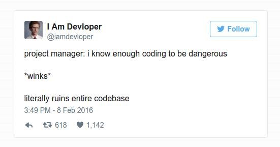

Это перевод англоязычной статьи [How to lint your Sass/CSS properly with Stylelint](http://www.creativenightly.com/2016/02/How-to-lint-your-css-with-stylelint/) автора [Scotty Vernon](https://twitter.com/KingScooty). Перед тем, как представить вам перевод, я бы хотел выразить огромную благодарность [Андрею Ситнику](https://twitter.com/andrey_sitnik) за помощь в вычитке перевода. И отдельно сказать ему спасибо за прекрасный инструмент [PostCSS](https://github.com/postcss/postcss), без которого не было бы и [Stylelint](http://stylelint.io/).

Линтинг файлов стилей. Так мало людей делают это. Однако, гораздо больше людей должны проверять файлы стилей, особенно в разношёрстных командах, где много человек правят код.

В этой статье я буду говорить о том, *зачем* мы должны линтить наши файлы стилей, и *как* линтить файлы таблиц стилей в процессе нашей сборки, как для чистого CSS, та и для Sass. 

**Содержание:**

1.  [Вступление](#introduction)
    1.  [Что такое линтинг?](#what-is-linting)
    2.  [Почему мы должны линтовать наши CSS?](#why-should-we-lint-our-stylesheets)
    3.  [Представляем Stylelint](#introducing-stylelint)
2.  [Настройка](#setup)
    1.  [Конфигурационные файлы Stylelint](#config-stylelint)
    2.  [Как линтовать ваш CSS](#how-to-lint-your-css)
    3.  [Как линтовать ваш Sass](#how-to-lint-your-sass)
3.  [Расширяем Stylelint плагинами](#extending-stylelint-with-plugins)
    1.  [Реальный пример: линтинг на практике](#case-study-linting-in-practice)
4.  [Послесловие](#afterword)
    1.  [Установи сборку Sass в gulp в один клик](#a-one-click-install-gulp-build-pipeline-for-sass)

## <a name="introduction"></a>Вступление

### <a name="what-is-linting"></a>Что такое линтинг?

Линтинг — это процесс проверки исходного кода на программные и стилистические ошибки. Это самый лучший способ выявления распространенных, и не очень, ошибок во время набора кода. Это как «проверка правописания» для языков программирования. В то время как линтинг полезен при самостоятельной работе, он становится незаменимым при работе в команде — когда много (неосторожных) рук касаются кода. Линт или линтер — инструмент реализующий проверку качества кода. Линтеры доступны для большинства языков: C, Python, JavaScript, CSS и прочих.

### <a name="why-should-we-lint-our-stylesheets"></a>Почему мы должны линтовать наши CSS?

Есть много причин линтить файлы стилей. Линтинг поддерживает единообразие кода, показывает ошибки в кодовой базе, помогает убрать ненужный код, а также помогает избежать опасностей из-за лени программистов.

Давайте рассмотрим несколько примеров.

```css
.no-space-after-colon {
    display:block; /* Нет пробела после двоеточия. */
}

.no-semicolon {
    position: relative /* Нет точки с запятой в конце. */
}
```

Линтеры очень хороши для отлавливания стилистических ошибок, какие вы увидели в коде выше. Хотя стилистические правила и не главное в линтере, они помогают поддерживать код однородным. Кроме того, не знаю как у вас, но две ошибки показанные выше, являются моим слабым местом.

```css
.invalid-hex {
    color: #FFF00G; /* Не правильно задан цвет в Hex. */
}
```

Они так же хороши в отлове описок (опечаток), как в примере с неправильным цветом. Ошибки такого типа могут сломать внешний вид страницы, если не будут отловлены.

```css
/* Ненужные префиксы. */
.unnecessary-prefixes {
    -webkit-border-radius: 5px;
    -moz-border-radius: 5px;
    border-radius: 5px;
}
```
Сегодня большинству CSS3-свойств больше не нужны префиксы. Линтинг позволяет найти ненужные префиксы и очистить устаревший код. Линтинг префиксов особенно полезен в паре с [Autoprefixer](https://github.com/postcss/autoprefixer) — он позволит вам убрать все префиксы из исходного кода и добавить нужные, в зависимости от настроек Autoprefixer, учитывая вашу аудиторию.

```css
.duplicate-rule {
    display: block;
    transition: opacity .2s;
    color: #444;
    background-color: #eee;
    transition: background-color .4s; /* Дублирование правила. */
}
```

Повторение свойств часто скрывает серьёзные ошибки. Что если разработчик хотел переход для обоих свойств `opacity` и `background-color`? В этом случае эффект перехода для `opacity` будет утерян. Линтинг покажет эту ошибку.

Достаточно убедительно? Если нет, то продолжайте чтение.

### <a name="introducing-stylelint"></a>Представляем Stylelint

[Stylelint](http://stylelint.io/) — супер-расширяемый CSS-линтер на JS, который вы можете настроить под свой вкус. Это самое новое и лучшие в мире линтинга CSS. Он поддерживает синтаксис по последним черновикам спецификаций, понимает другие CSS-подобные синтаксисы, а также расширяется с помощью плагинов. Более того, он гораздо быстрее [scss-lint](https://github.com/brigade/scss-lint), поскольку написан на JavaScript, а не на Ruby.

> Stylelint мощный, современный CSS линтер, который поможет вам обеспечить соблюдение единство стиля кода и избежать ошибок в ваших таблицах стилей.

Линтер разработан на базе [PostCSS](https://github.com/postcss/postcss), так что он понимает любой синтаксис, который может распарсить PostCSS, включая SCSS (и Less, прим. переводчика).

> PostCSS является инструментом для преобразования стилей с помощью плагинов на JS. Эти плагины могут проверять ваш CSS, добавлять в язык переменные и примеси, полифилить черновики спецификация CSS, встраивать изображения через base64.

Главное предназначение PostCSS — это делать одну вещь, и делать ее хорошо; всё остальное делают плагины. Сейчас насчитывается более 200 плагинов для PostCSS и, поскольку все они написаны на JavaScript, они работают супер-быстро!

PostCSS и Stylelint — это то, что мы будем использовать, чтобы линтить наши стили в следующем разделе.

## <a name="setup"></a>Настройка

### <a name="config-stylelint"></a>Конфигурационные файлы Stylelint

Красота Stylelint в том, что он не навязывает вам один стиль. Вы создаете свои наборы правил с нуля, так что он может быть настолько заносчивым и упрямым, насколько вы захотите. Вам не придётся тратить время на отключение ненужных правил, чтобы начать работу.

[Документация правил Stylelint](https://github.com/stylelint/stylelint/blob/master/docs/user-guide/rules.md) является хорошей отправной точкой. Так же вам доступны [стандартные настройки Stylelint](https://github.com/stylelint/stylelint-config-standard/blob/master/index.js), которые достаточно хорошо продуманы, чтобы использовать их для ваших проектов.

Мы начнём с небольшого файла, чтобы покрыть самое важное. Лично я считаю, что иметь чистый файл, лучше, чем переопределять стандартный файл настроек от команды Stylelint — лучше добавлять, что вам нужно, а не отключать лишнее.

Он выглядит так:

```javascript
"rules": {
  "block-no-empty": true,
  "color-no-invalid-hex": true,
  "declaration-colon-space-after": "always",
  "declaration-colon-space-before": "never",
  "function-comma-space-after": "always",
  "function-url-quotes": "double",
  "media-feature-colon-space-after": "always",
  "media-feature-colon-space-before": "never",
  "media-feature-name-no-vendor-prefix": true,
  "max-empty-lines": 5,
  "number-leading-zero": "never",
  "number-no-trailing-zeros": true,
  "property-no-vendor-prefix": true,
  "rule-no-duplicate-properties": true,
  "declaration-block-no-single-line": true,
  "rule-trailing-semicolon": "always",
  "selector-list-comma-space-before": "never",
  "selector-list-comma-newline-after": "always",
  "selector-no-id": true,
  "string-quotes": "double",
  "value-no-vendor-prefix": true
}

```

Я рекомендую внимательно изучить [описание правил Stylelint](https://github.com/stylelint/stylelint/blob/master/docs/user-guide/rules.md) и доработать его, создав ваш идеальный конфиг для линтера. Теперь давайте настроим нашу сборку, используя эти правила.

### <a name="how-to-lint-your-css"></a>Как линтовать ваш CSS

Давайте начнем с линтинга чистого CSS. Вы будете удивлены как легко его настроить! Инструменты, которые вам нужно установить: `gulp-postcss`, `postcss-reporter`, и `stylelint`. Давайте сделаем это.

```bash
npm install gulp-postcss postcss-reporter stylelint --save-dev
```
И вот файл для Gulp, чтобы собрать все это вместе:

```javascript
/**
 * Linting CSS stylesheets with Stylelint
 * http://www.creativenightly.com/2016/02/How-to-lint-your-css-with-stylelint/
 */

var gulp        = require('gulp');

var postcss     = require('gulp-postcss');
var reporter    = require('postcss-reporter');
var stylelint   = require('stylelint');

gulp.task("css-lint", function() {

  // Stylelint config rules
  var stylelintConfig = {
    "rules": {
      "block-no-empty": true,
      "color-no-invalid-hex": true,
      "declaration-colon-space-after": "always",
      "declaration-colon-space-before": "never",
      "function-comma-space-after": "always",
      "function-url-quotes": "double",
      "media-feature-colon-space-after": "always",
      "media-feature-colon-space-before": "never",
      "media-feature-name-no-vendor-prefix": true,
      "max-empty-lines": 5,
      "number-leading-zero": "never",
      "number-no-trailing-zeros": true,
      "property-no-vendor-prefix": true,
      "rule-no-duplicate-properties": true,
      "declaration-block-no-single-line": true,
      "rule-trailing-semicolon": "always",
      "selector-list-comma-space-before": "never",
      "selector-list-comma-newline-after": "always",
      "selector-no-id": true,
      "string-quotes": "double",
      "value-no-vendor-prefix": true
    }
  }

  var processors = [
    stylelint(stylelintConfig),
    // Pretty reporting config
    reporter({
      clearMessages: true,
      throwError: true
    })
  ];

  return gulp.src(
      // Stylesheet source:
      ['app/assets/css/**/*.css',
      // Ignore linting vendor assets:
      // (Useful if you have bower components)
      '!app/assets/css/vendor/**/*.css']
    )
    .pipe(postcss(processors));
});
```

Сложно ли это было? Я написал 50 строчек кода, включая привила линтера и импорты. Кстати, убедитесь, что вы изменили пути расположения исходников, согласно вашему проекту!

А ещё круче то, что вам нужно изменить только одну строку, чтобы включить поддержку SCSS. Давайте сделаем это сейчас...

### <a name="how-to-lint-your-sass"></a>Как линтовать ваш Sass

Линтовать файлы SCSS супер-просто с PostCSS. Единственное различие между линтингом CSS и SCSS в том, что вам нужно научить PostCSS понимать синтаксис `.scss`, и это так же просто, как установка `postcss-scss` и изменение одной строки в задаче выше.

```bash
npm install postcss-scss --save-dev
```

```javascript
  //[...]

  return gulp.src(
      ['app/assets/css/**/*.scss',
      '!app/assets/css/vendor/**/*.scss']
    )
    .pipe(postcss(processors, {syntax: syntax_scss})); ⬅
});
```

Вот полный файл для Gulp, чтобы линтить файлы SCSS:

```bash
npm install gulp-postcss postcss-reporter stylelint postcss-scss --save-dev
```

```javascript
/**
 * Linting Sass stylesheets with Stylelint
 * http://www.creativenightly.com/2016/02/How-to-lint-your-css-with-stylelint/
 */

var gulp        = require('gulp');

var postcss     = require('gulp-postcss');
var reporter    = require('postcss-reporter');
var syntax_scss = require('postcss-scss');
var stylelint   = require('stylelint');

gulp.task("scss-lint", function() {

  // Stylelint config rules
  var stylelintConfig = {
    "rules": {
      "block-no-empty": true,
      "color-no-invalid-hex": true,
      "declaration-colon-space-after": "always",
      "declaration-colon-space-before": "never",
      "function-comma-space-after": "always",
      "function-url-quotes": "double",
      "media-feature-colon-space-after": "always",
      "media-feature-colon-space-before": "never",
      "media-feature-name-no-vendor-prefix": true,
      "max-empty-lines": 5,
      "number-leading-zero": "never",
      "number-no-trailing-zeros": true,
      "property-no-vendor-prefix": true,
      "rule-no-duplicate-properties": true,
      "declaration-block-no-single-line": true,
      "rule-trailing-semicolon": "always",
      "selector-list-comma-space-before": "never",
      "selector-list-comma-newline-after": "always",
      "selector-no-id": true,
      "string-quotes": "double",
      "value-no-vendor-prefix": true
    }
  }

  var processors = [
    stylelint(stylelintConfig),
    reporter({
      clearMessages: true,
      throwError: true
    })
  ];

  return gulp.src(
      ['app/assets/css/**/*.scss',
      // Ignore linting vendor assets
      // Useful if you have bower components
      '!app/assets/css/vendor/**/*.scss']
    )
    .pipe(postcss(processors, {syntax: syntax_scss}));
});
```
Так легко! И это всё! Теперь вы можете линтить и CSS, и файлы SCSS.

Продолжайте читать, если вы хотите узнать о расширении Stylelint с помощью плагинов, и почему вы захотите это сделать.

## <a name="extending-stylelint-with-plugins"></a>Расширяем Stylelint плагинами

Так же, как PostCSS, Stylelint расширяется с помощью плагинов, что на самом деле удивительно!

Давайте рассмотрим маленький пример, где линтинг поможет улучшить читаемость кода, а также поможет пнуть ленивых разработчиков, когда они попытаются в легкую обойти стандарты принятые для вашего CSS кода в проекте.

### <a name="case-study-linting-in-practice"></a>Реальный пример: линтинг на практике

#### Проект-менеджер, который любит кодить

Как насчет такого сценария. Проект-менеджер управляет разработкой нового веб-приложения и, чтобы не отвлекать разработчиков, решает исправить код сам. Он решает добавить тень для бокса компонента на `:hover`, а также добавить состояние на `:hover` для ссылок дочернего узла компонента.

*Что может быть хуже?*



Вот код, который менеджер добавляет в проект:

```css
.component {
  position: relative;
  //[...]

  &:hover { ⬅
    box-shadow: 1px 1px 5px 0px rgba(0,0,0,0.75);

    .component__child { ⬅
      ul { ⬅
        li { ⬅
          a { ⬅
            &:hover { ⬅
              text-decoration: underline;
            }
          }
        }
      }
    }
  }
}
```
Ух!

#### Вложенность селекторов в Sass — это плохо! Используем линтер!

Вложенность селекторов является необходимым злом при разработке с использованием Sass; это действительно полезно при правильном использовании, но это один из способов путешествие в ад [специфичности](https://css-tricks.com/specifics-on-css-specificity/), если ей злоупотреблять. Вложенность, как правило, является последствием лени разработчика и в результате получается код, который трудно читаем, и плохо написан. Первое правило `&:hover{...}` может быть на 10 строк ниже определения родительского компонента, в результате сложно понять к чему оно относится. Однако, более важно то, что вложенность здесь вообще не нужна.

Вот CSS, в который будет скомпилировано правило, показанное выше:

```css
.component:hover .component_child ul li a:hover {}
/* Черт возьми, что это?! */
```

Если бы я работал в команде, и кто-то предложил бы такой код, то он бы имел очень серьезный разговор со мной.

Следующий разработчик, который приходит и хочет переопределить это правило каскадирования будет иметь проблемы. Зная об этом, я бы посоветовал воздержаться от использования вложенности любой ценой, по крайней мере, если вы не знаете, что вы делаете.

На счастье, для этого есть плагин! С помощью Stylelint мы можем установить плагин `stylelint-statement-max-nesting-depth`, и установить максимальный уровень вложенности, чтобы избежать излишней вложенности.

```bash
npm install stylelint-statement-max-nesting-depth --save-dev
```

И просто добавляем в наш файл для Gulp следующий код в таск `scss-lint `:

```javascript
gulp.task("scss-lint", function() {
  var stylelintConfig = {
    "plugins": [
      "stylelint-statement-max-nesting-depth"
    ],
    "rules": {
      //[...]
      "statement-max-nesting-depth": [3, { countAtRules: false }],
    }
  }

  //[..]
});
```

Для команд, которые знают, что они делают, я бы установил максимальный лимит вложенности равный трём. *(Установите его ниже для неопытных команд)*

С максимальным лимитом вложенности равным трём, Stylelint заставит проект-менеджера исправить код выше. Проект-менеджер пойдёт, подумает и вернётся с таким кодом:

```css
.component:hover {
  box-shadow: 1px 1px 5px 0px rgba(0, 0, 0, 0.75);

  .component__child {
    ul {
      li {
        a:hover {
          text-decoration: underline;
        }
      }
    }
  }
}
```

Исправленная версия кода более читаемая, но всё ещё не подходит. Там всё равно есть ненужная вложенность селекторов! Линтер знает это и заставляет проект-менеджера переосмыслить его реализацию, чтобы сборка прошла.

```css
.component:hover {
  box-shadow: 1px 1px 5px 0px rgba(0, 0, 0, 0.75);
}

.component__child {
  a:hover {
    text-decoration: underline;
  }
}
```

Вот, теперь мы уже пришли к чему-то! Теперь это будет принято линтером, и сборка пройдёт. Код выше не плох, но он всегда может быть лучше! Если вы хотите быть действительно *суровым*, вы можете отключить вложенность вовсе, оставив только `@ правила` (например для `@media`, — примечание переводчика). Это заставит членов команды, включая проект-менеджеров серьезно думать о том, что они пишут.

```css
.component:hover {
  box-shadow: 1px 1px 5px 0px rgba(0, 0, 0, 0.75);
}

.component__link:hover {
  text-decoration: underline;
}
```

Отлично! Без линтинга стилей при сборке, который заставлял рефакторить код — эта опасная лень не была бы поймана и качество кода постепенно бы деградировало.

Надеюсь, теперь я убедил вас, что линтинг стилей является выгодным вложением. Линтинг является вашим другом. Инвестиция недорогая, но она защищает команду от технической задолженности в виде плохо написанного кода.

В добрый путь, мой друг разработчик и дизайнер!

Иди и линтуй!

## <a name="afterword"></a>Послесловие

### <a name="a-one-click-install-gulp-build-pipeline-for-sass"></a>Установи сборку Sass в gulp в один клик

Хотели бы вы использовать мощь линтинга Sass, вместе с общим процессом gulp-сборки Sass бесплатно, просто установив небольшой пакет через `npm`? 

Я думаю да. У меня есть опенсорс проект под названием [Slushie](https://github.com/kingscooty/slushie), вы можете прочитать об этом в [моем блоге](http://www.creativenightly.com/2016/02/Slushie-the-pre-packaged-gulp-pipeline/).


> **Об авторе**
>
> [Scotty Vernon](https://twitter.com/KingScooty) (*Скотти Вернон*) является разработчиком-творцом и директором Wildflame Studios. Он работал с такими проектами, как  BBC Sport, BBC R&D и другими. Он всегда не далеко от твиттера, любит немецкое пиво, игры, а иногда и писать в третьем лице.

